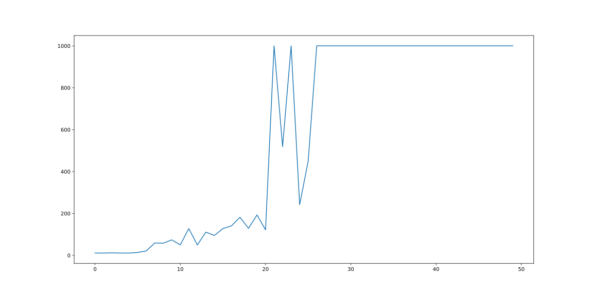

# Reinforcement Learning Experiments
In this repository I collect some experiments of different techniques to solve some reinforcement learning environments provided by OpenAI.

## Genetic Algorithms
I wrote an implementation of genetic algorithms that can be found in the `genetic_algorithm.py` file.

The algorithm lets the user define its own functions for the computation of the fitness and the generation of a child given two parents.  
The representation of each individual of a generation is up to the user.  
The top k% of the individuals are selected to be kept in the next generation.  
The selection of the parents is performed by sampling the generation weighting the individuals on their fitness value. So individuals with bigger fitness value are more likely to be selected as a parent for the new offspring.

## OpenAI Gym CartPole using Genetic Algorithms
I am using my implementation of genetic algorithms in order to train a neural network that is used as the policy by the agent. 

One generation is made of several individuals, and each individual is a configuration of the neural network.  
One configuration is represented with a flattened array of all the weights of the network.  
The fitness value of one configuration is computed by running one episode of the environment and returning the sum of the rewards.  
The generation of a child is performed by a single point crossover, with the point chosen randomly inside the array of the weights. After this, I add to each weight a random sample taken from a normal distribution with a probability given by the mutation probability.

The parameters of the genetic algorithms are the following:
- Size of a generation: 40
- Number of generations: 50
- Max number of steps for the environment: 1000
- Mutation probability: 0.05

The structure of the network is the following:
- Input layer size: 4
- First hidden layer: 10 neurons with ReLU activation function
- Second hidden layer: 5 neurons with ReLU activation funtion
- Output layer: 1 neuron with sigmoid activation function

The input of the network will be the observation provided by the environment, that is composed by 4 real values. The output will be a discrete binary action {Left, Right}.

The fitness during the 50 generations is

At the end, the agent learnt how to keep the pole balanced.

