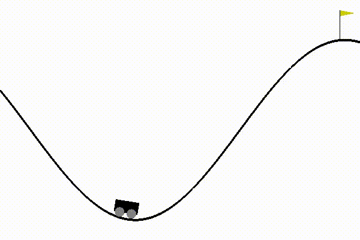

# Reinforcement Learning Experiments
In this repository I collect some experiments of different techniques to solve some reinforcement learning environments provided by OpenAI.

## Genetic Algorithms
I wrote an implementation of genetic algorithms that can be found in the `genetic_algorithm.py` file.

The algorithm lets the user define its own functions for the computation of the fitness and the generation of a child given two parents.  
The representation of each individual of a generation is up to the user.  
The top k% of the individuals are selected to be kept in the next generation.  
The selection of the parents is performed by sampling the generation weighting the individuals on their fitness value. So individuals with bigger fitness value are more likely to be selected as a parent for the new offspring.

The implementation supports multiprocessing to compute in parallel the fitness of one generation. In this way I can split the computation into N different processes.

## OpenAI Gym CartPole using Genetic Algorithms
I am using my implementation of genetic algorithms in order to train a neural network that is used as the policy by the agent.

The environment that I am going to solve is the [CartPole-v0](https://github.com/openai/gym/wiki/CartPole-v0) by OpenAI. 

One generation is made of several individuals, and each individual is a configuration of the neural network.  
One configuration is represented with a flattened array of all the weights of the network.  
The fitness value of one configuration is computed by running one episode of the environment and returning the sum of the rewards.  
The generation of a child is performed by a single point crossover, with the point chosen randomly inside the array of the weights. After this, I add to each weight a random sample taken from a normal distribution with a probability given by the mutation probability.

The parameters of the genetic algorithms are the following:

| Parameter                               | Value |
| --------------------------------------- | ----- |
| Generation Size                         | 40    |
| Number of Generations                   | 50    |
| Max number of steps for the environment | 1000  |
| Mutation Probability                    | 0.05  |

The structure of the network is the following:

| Layer         | Size | Activation |
| ------------- | ---- | ---------- |
| Input         | 4    |
| First hidden  | 10   | ReLU       |
| Second hidden | 7    | ReLU       |
| Output        | 1    | Sigmoid    |

The input of the network will be the observation provided by the environment, that is composed by 4 real values. The output will be a discrete binary action {Left, Right}.

The fitness during the 50 generations is

At the end, the agent learnt how to keep the pole balanced.

## OpenAI Gym MountainCar using Genetic Algorithms
The environment that I am going to solve is the [MountainCar-v0](https://github.com/openai/gym/wiki/MountainCar-v0) by OpenAI. 

We have the same settings of the problem with the CartPole-v0, we have generations of networks represented by the weights.  
The crossover and mutation operators are the same.

The differences are in the network structure and in the parameters of the genetic algorithm.

The parameters of the genetic algorithms are the following:

| Parameter                               | Value |
| --------------------------------------- | ----- |
| Generation Size                         | 50    |
| Number of Generations                   | 100   |
| Max number of steps for the environment | 1000  |
| Mutation Probability                    | 0.1   |

The structure of the network is the following:

| Layer         | Size | Activation |
| ------------- | ---- | ---------- |
| Input         | 2    |
| First hidden  | 10   | ReLU       |
| Second hidden | 7    | ReLU       |
| Output        | 3    | Softmax    |

The output layer has one neuron for each action.

The input to the network is the observation provided by the environment, that are the position and the speed of the car. The output of the network will be one discrete action in {Left, Nothing, Right}.

The fitness values for different generations are the following

|   Generation   |                                       Plot                                       |                                         Boxplot                                          |
| :------------: | :------------------------------------------------------------------------------: | :--------------------------------------------------------------------------------------: |
| Generation 20  |  |  |
| Generation 40  |  |  |
| Generation 60  |  |  |
| Generation 80  |  |  |
| Generation 100 |                   |                   |

The resulting agents in different generations are the following:

 |                                                                                                                                 |                                                                                                                                  |
 | :-----------------------------------------------------------------------------------------------------------------------------: | :------------------------------------------------------------------------------------------------------------------------------: |
 |     Generation 1  |    Generation 20  |
 |    Generation 40 |     Generation 60 |
 |    Generation 80 |             Generation 100           |
